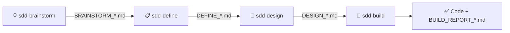

# The SDD Starter workflow

> 🇧🇷 [Versão em Português](workflow.pt-BR.md)

Spec-Driven Development (SDD) means the specification — not the prompt — drives the code. SDD Starter breaks that into five phases, each owned by one skill, each producing one Markdown artifact that feeds the next phase. A sixth skill, `sdd-kb`, is complementary: it is not part of the sequence and feeds any phase.

## Phase by phase

### 💡 Brainstorm — explore before you commit

The skill interviews you **one question at a time** (minimum three), always asks for samples/examples/related code, proposes **2–3 distinct approaches** with an explicit recommendation, applies YAGNI to the scope, and only writes the `BRAINSTORM_*.md` after you confirm the direction.

**Skip it** only when problem, users, goals, success criteria, constraints, and scope are already clear — then start at Define.

### 📋 Define — make it testable

Turns the Brainstorm into formal requirements: problem, users, goals, metrics, scope, constraints. Its two teeth:

- **Acceptance tests in EARS** — a controlled English pattern (`WHEN <trigger> THE SYSTEM SHALL <response>`) that kills ambiguity.
- **Verify Gate** — an objective pass/fail criterion, decided *before* any code exists, that the Build phase must satisfy.

It computes a **Clarity Score**, asks clarification questions only for blocking gaps, and hands off to Design.

### 📐 Design — decide how, in writing

Transforms requirements into architecture: components, data flow, integrations, error handling, test strategy — plus two artifacts that keep the Build honest:

- **ADRs inline** — each significant decision recorded with alternatives and rationale.
- **File Manifest** — the complete list of files the Build is allowed to create or change.

If you have a UX review document, hand it to Design as optional input.

### 🔨 Build — implement exactly what was designed

The only phase that needs write access to a project. It reads all three artifacts, confirms an execution mode with you, changes **only** what the File Manifest allows, verifies incrementally, detects drift between spec and reality, and finishes by running the **Verify Gate from the Define — as a blocking gate**. The output is working code plus a `BUILD_REPORT_*.md` with evidence.

## Rules that hold the flow together

1. **Artifacts are the interface.** Each skill reads the previous artifacts and writes exactly one new one, from the canonical template in its `assets/` folder.
2. **Next Step is explicit.** Every artifact ends with a single handoff line naming the next skill. The Build report ends by closing the flow: review the BUILD_REPORT and release through your own process.
3. **No inventing.** Skills are instructed to mark ambiguities and ask, never guess. Facts must trace back to an artifact or to your answers.
4. **Gates are blocking.** A Define without a Verify Gate is not done; a Build that fails the Verify Gate is not complete — it's blocked, and the report says so.

## Portability

Phases 1–3 are pure conversation + Markdown: they run in any capable chat agent, with no internet, repo, or filesystem access assumed. Phase 4 runs in whatever coding agent you use — Claude Code, Codex, Cursor, Lovable, Base44 — targeting any platform that agent can build for.
