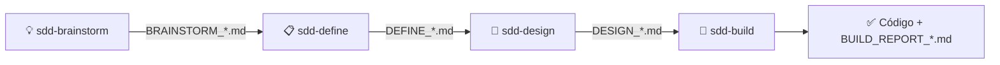

# O workflow do SDD Starter

> 🇺🇸 [English version](workflow.md) (canônica)

Spec-Driven Development (SDD) significa que a especificação — não o prompt — dirige o código. O SDD Starter quebra isso em quatro fases, cada uma dona de uma skill, cada uma produzindo um artefato Markdown que alimenta a fase seguinte.

## Fase a fase

### 💡 Brainstorm — explore antes de se comprometer

A skill te entrevista **uma pergunta por vez** (mínimo três), sempre pede amostras/exemplos/código relacionado, propõe **2–3 abordagens distintas** com recomendação explícita, aplica YAGNI ao escopo e só escreve o `BRAINSTORM_*.md` depois que você confirma a direção.

**Pule esta fase** apenas quando problema, usuários, objetivos, critérios de sucesso, restrições e escopo já estiverem claros — nesse caso, comece pelo Define.

### 📋 Define — torne testável

Transforma o Brainstorm em requisitos formais: problema, usuários, objetivos, métricas, escopo, restrições. Seus dois dentes:

- **Testes de aceitação em EARS** — um padrão de escrita controlada (`WHEN <gatilho> THE SYSTEM SHALL <resposta>`) que mata a ambiguidade.
- **Verify Gate** — um critério objetivo de passa/falha, decidido *antes* de existir código, que a fase Build terá que satisfazer.

Calcula um **Clarity Score**, faz perguntas de clarificação só para lacunas bloqueantes e passa o bastão para o Design.

### 📐 Design — decida o como, por escrito

Transforma requisitos em arquitetura: componentes, fluxo de dados, integrações, tratamento de erros, estratégia de testes — mais dois artefatos que mantêm o Build honesto:

- **ADRs inline** — cada decisão significativa registrada com alternativas e justificativa.
- **File Manifest** — a lista completa dos arquivos que o Build está autorizado a criar ou alterar.

Se você tiver um documento de revisão de UX, entregue-o ao Design como entrada opcional.

### 🔨 Build — implemente exatamente o que foi desenhado

A única fase que precisa de acesso de escrita a um projeto. Lê os três artefatos, confirma com você um modo de execução, altera **somente** o que o File Manifest permite, verifica incrementalmente, detecta drift entre especificação e realidade, e termina executando o **Verify Gate do Define — como gate bloqueante**. A saída é código funcionando mais um `BUILD_REPORT_*.md` com evidências.

## Regras que seguram o fluxo

1. **Artefatos são a interface.** Cada skill lê os artefatos anteriores e escreve exatamente um novo, a partir do template canônico da sua pasta `assets/`.
2. **Next Step é explícito.** Todo artefato termina com uma única linha de handoff nomeando a próxima skill. O relatório de Build encerra o fluxo: revise o BUILD_REPORT e publique pelo seu próprio processo.
3. **Nada de inventar.** As skills são instruídas a marcar ambiguidades e perguntar, nunca adivinhar. Todo fato precisa rastrear até um artefato ou até as suas respostas.
4. **Gates são bloqueantes.** Um Define sem Verify Gate não está pronto; um Build que falha no Verify Gate não está completo — está bloqueado, e o relatório diz isso.

## Portabilidade

As fases 1–3 são pura conversa + Markdown: rodam em qualquer agente de chat capaz, sem assumir internet, repositório ou filesystem. A fase 4 roda no agente de código que você usar — Claude Code, Codex, Cursor, Lovable, Base44 — mirando qualquer plataforma que esse agente saiba construir.
